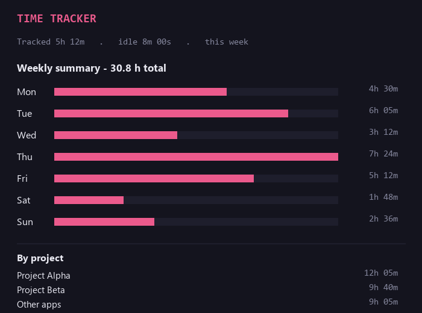
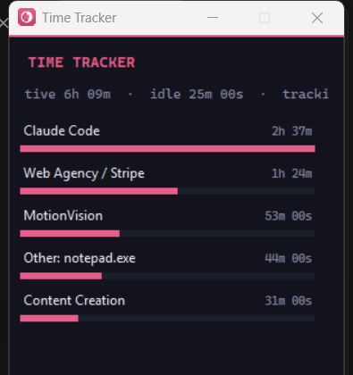

# Time Tracker

[](https://github.com/darkspaz-v1/time-tracker/actions/workflows/ci.yml)

Where your time actually went, per project, with no manual start/stop.





*Example panel with invented sample data (not a real activity log).*

## Quick start

```
py -m venv venv
venv\Scripts\pip install -r requirements.txt
run.bat
```

Create the virtualenv and install once; after that `run.bat` starts the tray app using `venv\Scripts\pythonw.exe`.
Windows only — these use Win32 APIs and a system tray.

## How it works

- Tray plus panel. Samples the foreground window and matches its process name and title against
  project buckets defined in `config.json`.
- **Idle-aware** — stops counting after an input-idle threshold (default 3 minutes), so lunch does
  not get billed to whatever happened to be on screen.
- Anything that matches no bucket is still recorded as `Other: <process>` rather than being dropped.
  That list is how you find out which bucket you are missing.
- Output is `time_log.json`, a plain `{date: {bucket: seconds}}` map — deliberately trivial to read
  from something else.

## Notes

Buckets match on **window title keywords as well as process name**, because most real work happens
inside a handful of processes (a browser, a terminal, an editor) where the process name tells you
nothing about the project. Renaming a bucket is safe: keep the old keyword in the list and historical
titles keep matching.

**Stack:** Python, Tkinter, `pystray`, Pillow.

## Part of a suite

One of seven small Windows tray utilities built as separate, self-contained apps: each has its own
folder, its own virtualenv and its own `run.bat`, with no shared runtime. They are deliberately not a
framework — the only thing they share is a set of conventions.

| Convention | Why |
|---|---|
| Single-instance guard via a `.singleton.lock` file | An earlier `.instance.lock` design could get stuck after a force-kill and leave the app permanently unlaunchable |
| Relaunch brings the existing window forward | Previously a second launch silently did nothing, which was indistinguishable from the app being broken |
| Config lives in `config.json`, read at startup | Edit it, then fully exit the tray icon and relaunch — a running process never re-reads it |
| Tray icon generated in code (`icon.py`) | No binary asset to keep in sync |

## Known limitations

- **Windows only** — foreground-window detection and idle time both come from Win32 APIs; there's no
  macOS/Linux equivalent.
- **Idle threshold is configurable, not fixed** — `idle_threshold_minutes` in `config.json` (default 3);
  changing it requires fully exiting the tray icon and relaunching, since config is only read at startup.
- **Per-project bucketing depends on window-title matching** — a bucket only catches what its
  `processes`/`title_keywords` list expects, so a renamed window title or an app not yet added to
  `config.json` falls through to an individual `Other: <process>` entry instead of being miscategorized.

## Development

```
venv\Scripts\pip install -r requirements-dev.txt
venv\Scripts\python -m pytest
venv\Scripts\ruff check .
```

The tests cover the pure logic only (idle threshold, window-title bucketing, log persistence); they never
open a window. CI runs the same two commands on Windows with Python 3.12 and 3.13.

## Troubleshooting

Log file location: `logs/time-tracker.log` next to `app.py` (rotating, 1 MB x 3). Set `APP_LOG_LEVEL=DEBUG`
before launching to also record errors the app deliberately ignores. A crash traceback goes to `app_error.log`.

## License

MIT — see [LICENSE](LICENSE).
